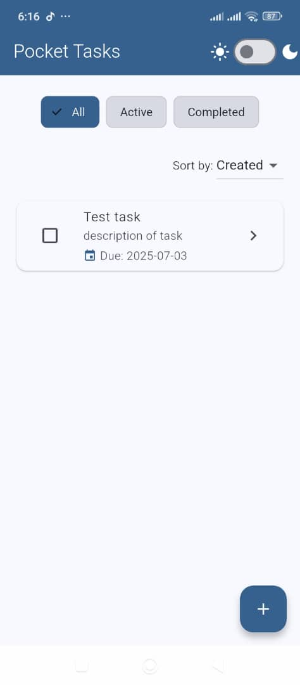
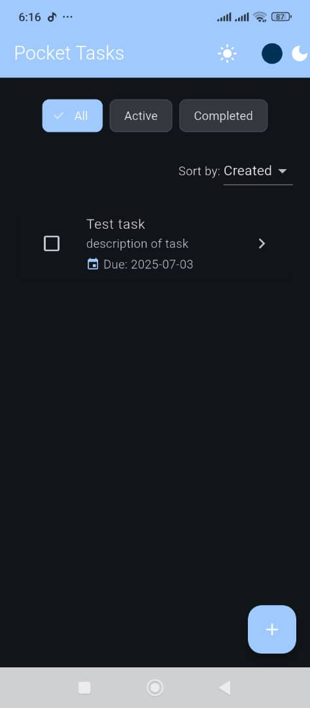

# 📱 Pocket Tasks

A beautifully designed Flutter task management app with sorting, filtering, light/dark theme, local storage using Hive, and animations.

## ✨ Features

- 📝 Add, edit, delete tasks
- 📆 Set due dates
- ✅ Mark tasks as completed
- 🔍 Filter by status (All / Active / Completed)
- 📊 Sort by creation or due date
- 🌗 Light & dark theme toggle
- 💾 Local storage with Hive
- 💡 Riverpod for state management
- 🎨 Responsive, clean UI

## 📸 Screenshots

| Light Mode | Dark Mode |
|------------|-----------|
|  |  |

## 📽️ Demo

Link Google Drive:

- [Download from Google Drive](https://drive.google.com/file/d/1U4aJm87b5ZL5J-87VqQtNOP_KtlEDTJt/view?usp=drive_link)

## 🚀 Getting Started

### Prerequisites
- Flutter SDK
- Dart SDK

### Run the App
```bash
flutter pub get
flutter run
```

### Run Tests
```bash
flutter test
```

## 📦 APK Location
The built APK can be found at:
```
build/app/outputs/flutter-apk/app-release.apk
```

## 📂 Project Structure
```bash
lib/
├── main.dart
├── features/
│   └── task/
│       ├── domain/
│       ├── provider/
│       └── presentation/
│           ├── pages/
│           └── widgets/
```

## 📚 Packages Used
- flutter_riverpod
- hive & hive_flutter
- uuid
- intl


## 📝 Developer

**Etim Essang**  
Flutter Developer | [LinkedIn](https://www.linkedin.com/in/etim-essang-6bb637a7/) | [GitHub](https://github.com/demsoft)
## 📄 License
MIT
